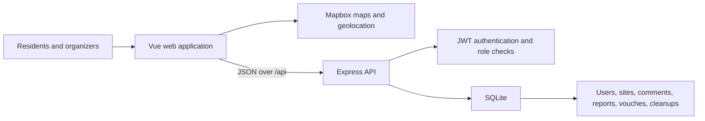

# Open Waste Map

> Map waste. Verify reports. Organize action.

Open Waste Map is a community-driven application for documenting unmanaged
waste, validating observations, discussing changes, and organizing cleanups.
It is designed to work for a neighborhood, municipality, country, or
international community—the product has no hard-coded country boundary.

The application is a civic coordination tool, not an official environmental
registry. Community-submitted data should be verified before it is used for
enforcement, health, or safety decisions.

## What it supports

Visitors can:

- Explore waste sites on a clustered satellite map.
- Color markers by contamination status, waste type, or site size.
- View descriptions, coordinates, reports, comments, vouches, and cleanups.
- Use browser geolocation to find their position on the map.

Registered contributors can:

- Add a waste site anywhere with valid latitude and longitude.
- Confirm a report with one vouch per account.
- Add local context through comments and issue reports.
- Schedule community cleanup events.
- Review recent sites, statistics, and upcoming cleanups on the dashboard.

Cleanup organizers can update their events. Administrators can review reports
and mark them as pending, resolved, or rejected through the API.

## Architecture at a glance



| Layer | Technology |
| --- | --- |
| Web application | Vue 3, Vite, Vue Router, Pinia |
| Mapping | Mapbox GL JS |
| Styling | Tailwind CSS |
| HTTP client | Axios |
| API | Node.js, Express 5 |
| Authentication | JSON Web Tokens, bcryptjs |
| Persistence | SQLite 3 |
| Tests | Node.js test runner |

The public product and API use the term **site**. The database and some
internal modules retain the original `depo` name to preserve compatibility;
these are implementation details and can be migrated separately.

## Project structure

```text
map-depo/
├── backend/
│   ├── config/          # Server and database configuration
│   ├── controllers/     # Validation, authorization, request handling
│   ├── middleware/      # JWT authentication
│   ├── models/          # SQL access, migrations, serialization
│   ├── routes/          # REST route definitions
│   ├── test/            # API integration test
│   └── server.js        # API entry point and health endpoint
├── frontend/
│   ├── src/
│   │   ├── components/  # Forms, site UI, dashboard, map feature
│   │   ├── config/      # Environment-backed product configuration
│   │   ├── router/      # Routes and access guard
│   │   ├── stores/      # Authentication and site state
│   │   ├── utils/       # Map data and viewport utilities
│   │   └── views/       # Route-level composition
│   └── vite.config.js
├── docs/
│   ├── API.md
│   ├── ARCHITECTURE.md
│   ├── CONFIGURATION.md
│   └── ROADMAP.md
└── CONTRIBUTING.md
```

## Getting started

### Prerequisites

- Node.js 20 or later
- Yarn 1.x, available directly or through Corepack
- A public [Mapbox access token](https://account.mapbox.com/access-tokens/)

### 1. Install dependencies

```sh
cd backend
yarn install

cd ../frontend
yarn install
```

### 2. Configure the applications

```sh
cp backend/.env.example backend/.env
cp frontend/.env.example frontend/.env.local
```

Change `JWT_SECRET` in `backend/.env` and set `VITE_MAPBOX_TOKEN` in
`frontend/.env.local`. The Mapbox token is required for map rendering.

The default map starts with a world view and automatically frames the loaded
sites. Set `VITE_MAP_CENTER`, `VITE_MAP_ZOOM`, and
`VITE_MAP_AUTO_FIT=false` when an installation should open on a specific
region.

See [Configuration](docs/CONFIGURATION.md) for every variable and production
guidance.

### 3. Start the API

```sh
cd backend
yarn start
```

The API listens on [http://localhost:3000/api](http://localhost:3000/api).
Its health check is `GET /api/health`.

### 4. Start the web application

In another terminal:

```sh
cd frontend
yarn dev
```

Open the address printed by Vite, normally
[http://localhost:5173](http://localhost:5173).

### Demo data

Unless `SEED_DATABASE=false`, startup creates clearly labeled example sites
across several world regions and two local development accounts:

| Role | Username | Password |
| --- | --- | --- |
| Contributor | `demo` | `test123` |
| Administrator | `admin` | `admin123` |

Do not enable demo seeding or use these credentials in a public deployment.

## Typical workflow

1. Open the map and explore existing reports.
2. Register or sign in.
3. Click an empty point on the map.
4. Describe and classify the waste, then submit the location.
5. Select a marker to vouch, comment, report a change, or schedule a cleanup.
6. Use the dashboard to review recent activity and upcoming events.

## API overview

All endpoints are under `/api`. Protected requests use:

```http
Authorization: Bearer <token>
```

| Area | Canonical endpoints | Access |
| --- | --- | --- |
| Health | `GET /health` | Public |
| Authentication | `POST /register`, `POST /login` | Public |
| Sites | `GET /sites`, `GET /sites/:id` | Public |
| Site management | `POST /sites`, `PUT /sites/:id` | Authenticated |
| Comments | `GET/POST /sites/:id/comments` | Public / authenticated |
| Reports | `GET/POST /sites/:id/reports` | Public / authenticated |
| Vouches | `GET/POST/DELETE /sites/:id/vouches` | Public / authenticated |
| Cleanups | `GET /cleanups`, `GET /cleanups/upcoming` | Public |
| Site cleanups | `GET/POST /sites/:id/cleanups` | Public / authenticated |
| Moderation | `GET /reports`, `PUT /reports/:id/status` | Administrator |

The former `/depos` routes remain available as compatibility aliases. New
clients should use `/sites`.

See the complete [API reference](docs/API.md).

## Verification

Run the backend integration test:

```sh
cd backend
yarn test
```

It covers the health endpoint, authentication, global coordinate validation,
canonical and legacy site routes, comments, reports, moderation, cleanups, and
vouches using an in-memory database.

Run the frontend map utility tests and production build:

```sh
cd frontend
yarn test
yarn build
```

The static output is generated in `frontend/dist/`.

## Documentation

- [Configuration and regional deployments](docs/CONFIGURATION.md)
- [Architecture and data flows](docs/ARCHITECTURE.md)
- [REST API reference](docs/API.md)
- [Project assessment and roadmap](docs/ROADMAP.md)
- [Contribution guide](CONTRIBUTING.md)

## Current scope

Open Waste Map is a working community-project prototype. SQLite and a
two-process frontend/API setup keep local development simple. Before a large
public deployment, prioritize bounded map queries, rate limiting, centralized
schema validation, media storage, frontend test coverage, observability, and a
production database. These items are detailed in the
[roadmap](docs/ROADMAP.md).
