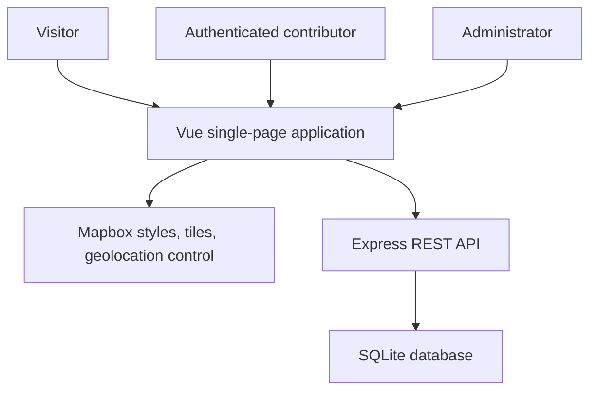
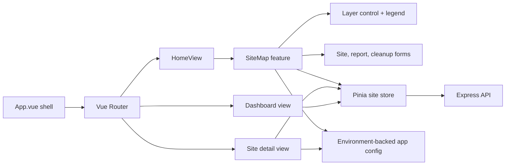
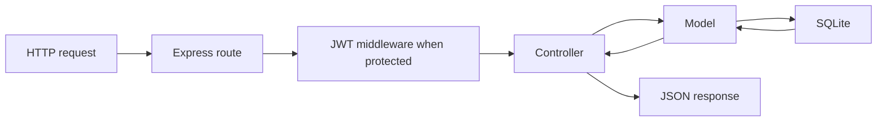
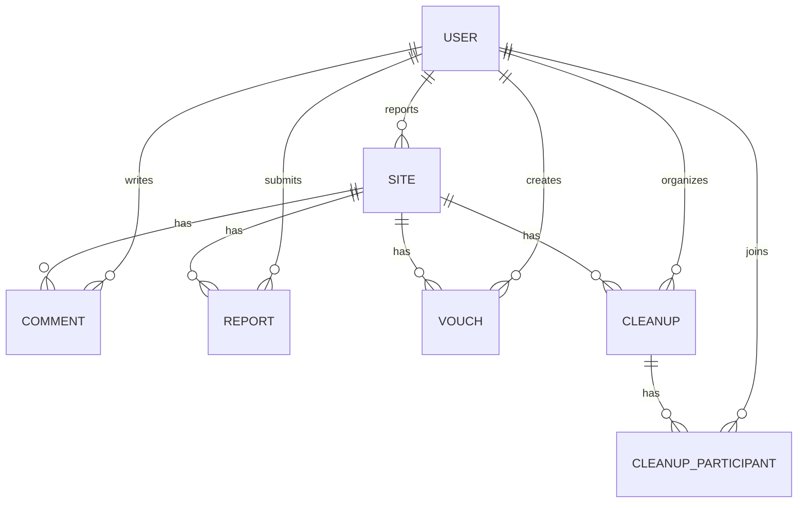

# Architecture

## System context

Open Waste Map connects residents who observe unmanaged waste with other
contributors, cleanup organizers, and report moderators.

Mapbox receives map-related browser requests. Application records and account
operations go through the Express API.

## Runtime components

### Frontend

The frontend is a Vue 3 application using the Composition API.

Responsibilities:

- `App.vue` renders the product shell, navigation, and environment-backed
  branding.
- Route views compose features and avoid owning full feature
  implementations.
- `components/map/SiteMap.vue` owns Mapbox lifecycle, GeoJSON sources,
  clustering, marker interaction, and side-panel selection.
- `MapLayerControl.vue` emits a selected visualization mode.
- `MapLegend.vue` owns only legend visibility and presentation.
- Forms own local input state and emit completed actions upward.
- Pinia stores own API communication and shared authentication/site state.
- `config/app.js` is the only source for product, API, and map environment
  defaults.
- `utils/map.js` contains pure GeoJSON, color-expression, and bounds logic.

Mapbox instances use shallow Vue references because third-party class
instances should not be deeply proxied. Derived values such as recent sites
and dashboard statistics are computed from store state.

### Backend

The backend follows a route-controller-model structure:

- Routes define canonical `/sites` paths and legacy `/depos` aliases.
- Controllers validate input, verify ownership/roles, and choose status codes.
- Models execute parameterized SQL and serialize database rows.
- Startup runs versioned schema migrations and optional demo seeding.
- `GET /api/health` provides a lightweight process health signal.

## Domain model

The physical table for sites is still named `depos`. This is a compatibility
boundary, not a product requirement. Public JSON uses:

- `reportedBy` for the submitting user.
- `vouchCount` for the denormalized confirmation count.
- `createdAt` for creation timestamps.

Site classification values:

- Status: `clean`, `low`, `medium`, `high`
- Type: `garbage`, `debris`, `landfill`, `electronic`, `hazardous`,
  `construction`, `organic`, `plastic`, `other`
- Size: `small`, `medium`, `large`

## Important flows

### Create a site

1. An authenticated user clicks an empty map location.
2. The form uses that location or requests browser geolocation.
3. The API validates required fields and global coordinate ranges.
4. SQLite stores the site and returns the serialized record.
5. The frontend refreshes the shared GeoJSON source and selects the new site.

Latitude `0` and longitude `0` are valid. Validation rejects latitude outside
`-90..90` and longitude outside `-180..180`.

### Load the map

1. The frontend loads public sites from `GET /api/sites`.
2. Configuration supplies the initial world or regional viewport.
3. Valid coordinates become clustered GeoJSON points.
4. When auto-fit is enabled, the map frames the loaded data.
5. Marker colors are recalculated when the user selects status, type, or size.

### Authenticate a request

1. Registration or login returns a 24-hour JWT by default.
2. The browser stores the token and public user record in local storage.
3. Protected requests send `Authorization: Bearer <token>`.
4. Middleware verifies the signature and reloads the user from SQLite.
5. Controllers enforce ownership or administrator role where required.

## Compatibility

Canonical external terminology is `site`. Legacy `/depos` API routes and the
old `/depo/:id` browser path remain available so existing links and clients do
not break. The browser path redirects to `/sites/:id`.

## Known constraints

- `GET /sites` returns the full collection; it does not yet query by viewport.
- SQLite is appropriate for a small single-instance deployment, not
  horizontally scaled writes.
- Report image selection is only a frontend preview; no upload service exists.
- There is no rate limiting or centralized request-schema library.
- Frontend automated coverage is limited to map utilities; component/browser
  coverage and an administrator moderation interface are not implemented.

See [ROADMAP.md](ROADMAP.md) for recommended next steps.
